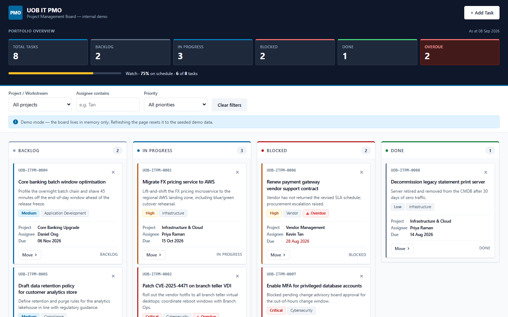

# uobclaudetraining

A single-page IT project management Kanban board, built as a training exercise with
Claude Code.

**[▶ Open the live demo](https://hadisgh2811.github.io/uobclaudetraining/)**

[](https://hadisgh2811.github.io/uobclaudetraining/)

> Internal demo / training artefact. It is not an official UOB system and uses no real UOB
> logo, trademark or branding — only a neutral "UOB IT PMO" text wordmark.

## Running it

Either [open it in the browser](https://hadisgh2811.github.io/uobclaudetraining/), or
download [`index.html`](index.html) and double-click it. That's the whole app — markup,
styles and script in one file, with no build step, no dependencies and no server.

## What it does

Four fixed columns (Backlog / In Progress / Blocked / Done) with drag-and-drop between
them, plus a keyboard-accessible `Move ▸` control on every card so the board works without
a mouse. Cards are colour-coded by priority, flagged when overdue, and deleted through an
inline Yes/No confirmation rather than a browser dialog. Above the board there is a live
summary strip and client-side filters for project, assignee and priority. Adding a task
goes through a validated form that shows inline field errors.

The board is seeded with 8 demo tasks and **holds its state in memory only** — no
`localStorage`, no cookies, no database. Refreshing the page resets it to the seed data.
That is intentional for a training demo, and the UI says so.

## Email notifications (optional)

New tasks are announced by email through [FormSubmit](https://formsubmit.co). To point it
at your own inbox, edit the one config constant near the top of the `<script>` block:

```js
const FORMSUBMIT_ENDPOINT = "https://formsubmit.co/ajax/YOUR_EMAIL@example.com";
```

FormSubmit needs a **one-time activation** per address: the first submission triggers a
confirmation email, and nothing is delivered until you click the link in it.

Until that is done, adding a task shows an amber *"Card added locally — email notification
failed"* toast. That is expected — the notification is optional and its failure never
affects the board.

## Security posture

The board takes no login and stores nothing, so the interesting boundaries are
the two places untrusted data crosses: typed text reaching the DOM, and task
data leaving for the notification endpoint.

| Control | What it covers |
| --- | --- |
| `escapeHtml()` on every interpolated value | Script injection through any task field |
| Content Security Policy | Second layer if an escape is ever missed — `default-src 'none'`, no external origin, `connect-src` limited to the one endpoint, `form-action 'none'`, `base-uri 'none'` |
| Input sanitisation | Strips control characters, bidi overrides and zero-width joiners, so a name cannot be made to display as someone else's |
| Allowlist re-validation in `addTask()` | Project, category, priority and status are re-checked at the only door into state, not merely at the form |
| `referrer: no-referrer` + `credentials: omit` | The page URL and any cookies stay out of the third-party request |
| Board cap and submit interval | Bounds memory growth and stops the captcha-less endpoint being hammered |
| Request timeout | A stalled notification cannot leave the form disabled indefinitely |

`frame-ancestors` is declared but browsers ignore it in a `<meta>` tag — real
clickjacking cover needs a response header, so the page also checks at runtime
whether it has been framed by another origin and warns if so.

## Repository contents

| File | |
| --- | --- |
| `index.html` | The entire application |
| `404.html` | Fallback page for unknown paths on the published site |
| `CLAUDE.md` | Architecture and constraints, for working on this with Claude Code |
| `.github/workflows/deploy-pages.yml` | Publishes the site to GitHub Pages on every push to `main` |
| `.claude/commands/` | Project slash commands for Claude Code |
| `.mcp.json` | Registers the Playwright MCP server used to capture the screenshot |
| `docs/screenshot.png` | The board, captured from the published site |
